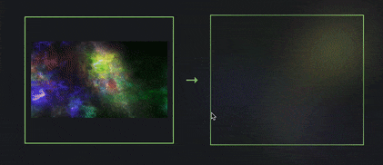

# video-ambient
Realtime video ambient backlighting with full control



Zero dependency, framework agnostic, written in TypeScript.

Created by accident, maybe someone will make use of it.


## How it works
It scales down video to (size px, size px) on an invisible canvas, reads pixel colors, and generates conic-gradient

Feel like doing more fancy stuff? Got you covered! There is an array with colors in the callback - use it as you want.
## Usage

```typescript
let gradient;
new VideoAmbient({
    video,
    size: 3,
    mount: document.querySelector('body'),
    onChange: (data) => {
        gradient = data.gradient
    },
});
```

```html
<div class="ambient" style={`--ambient-gradient: ${gradient};`}></div>
```

```css
.ambient {
    background: var(--ambient-gradient);
    width: 100%;
    height: 100%;
    filter: blur(50px);
}
```

## Options
```typescript
new VideoAmbient(
    /** video element **/
    video: HTMLVideoElement;

    /** invisible canvas dimensions (size x size), higher value = more colors **/
    size?: number;
    
    /** gradient colors opacity **/
    opacity?: number;
    
    /** callback on ambient change **/
    onChange?: (props: VideoAmbientChangeProps) => void;
    
    /** mounting point for invisible canvas, by default document.body  **/
    mount?: HTMLElement;
    /** for own canvas  **/
    canvas?: HTMLCanvasElement;
});
```

## License
MIT

Copyright 2023 Marcin Sobczak, [sobczak.me](https://sobczak.me)
